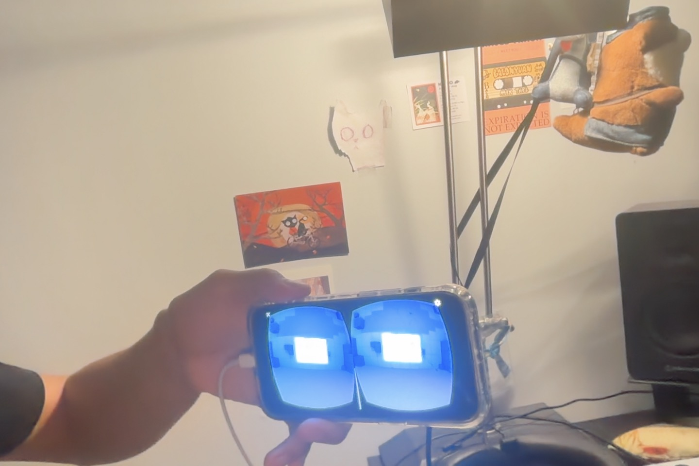

# Job Application Game

This project counts as a game using Jesse Schell’s Chapter 4 framework because it brings together the Elemental Tetrad: mechanics, story, aesthetics, and technology. The mechanics are straightforward: the player looks at a job application, taps to send it, watches what happens, and keeps track of applications and interviews. There is a 10 percent chance of moving forward, which adds uncertainty, and the counters give the player a clear record of progress. Most applications explode without success, while occasional confetti gives a reward. That makes each choice feel like it matters and creates a repeating loop with a goal.

The story is simple, but it still works. The player is sending job applications and hoping to get interviews, which is a familiar and stressful situation. The white form, its label, the explosions, and the “you moved on to the next round” message all support that idea without needing a lot of dialogue. The aesthetics also add to the experience. Vine boom, colorful confetti, movement, and the camera HUD make the game feel funny, surprising, and a little tense.

The technology includes Unity, Cardboard gaze controls, iPhone touch, sounds, animations, and world-space UI. On their own, these are just tools. Together, though, they support the mechanics, story, and look of the game. That is why this feels like a playable game, not just an animation.

## Deployment proof

